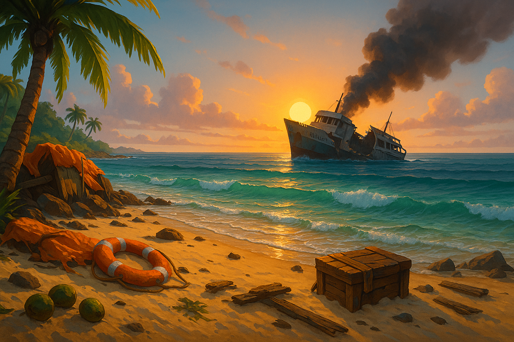
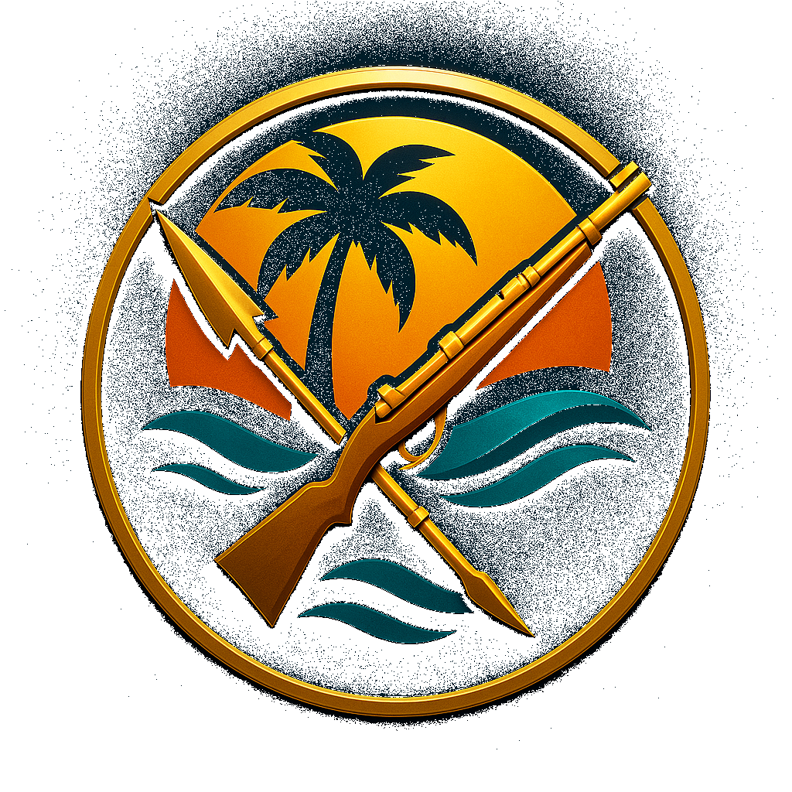

# Isle Fight You 🏝️🔫

Paradise punches back.

A browser‑based island builder with guns, coconuts, and enough PvP to ruin even the sunniest holiday. Runs in WebGL, hosted on Vercel, backed by Supabase. Built for mobile first but plays fine on your 34‑inch ultrawide if you must.

## 🎮 Game Preview

<div align="center">


*Beautiful 3D island survival with modern UI and mobile-first design*

</div>

### 🌟 Visual Showcase

The game features a stunning 3D environment with:

- **🏝️ Natural Terrain Generation**: Smooth heightmap-based islands with realistic biomes
- **👤 Enhanced Character Model**: Anthropomorphic design with natural proportions and animations  
- **🎯 Intuitive UI**: Clean, mobile-optimized interface with survival stats and resource management
- **🌊 Immersive Environment**: Dynamic lighting and atmospheric backgrounds



*Loading screen featuring the atmospheric island environment*

### 🎮 Current Game Interface

The live application features a sophisticated 3D game interface:

**Main Game View:**
- 🌍 **3D Island Terrain**: Smooth, natural heightmap-based landscape with realistic biomes
- 👤 **Animated Character**: Enhanced anthropomorphic player model with physics-based movement
- 🎯 **Clean UI Overlay**: Transparent interface elements that don't obstruct gameplay

**HUD Elements:**
- 🏥 **Top Status Bar**: Health (❤️ 100/100), Hunger (🍖 100), Thirst (💧 100), Level (⭐ Lv.1), Experience (📈 0 XP)
- 💰 **Resource Display**: Current inventory with Gold (💰 100), Pearls (💎 0), and materials
- 🎒 **Action Buttons**: Inventory, Build, and Settings panels with modern icon design
- 🎮 **Control Instructions**: Contextual help for keyboard (WASD, Space) and mobile controls

**Visual Quality:**
- ✨ **WebGL Rendering**: Hardware-accelerated 3D graphics running at 60fps
- 🌅 **Atmospheric Lighting**: Dynamic lighting system with ambient shadows
- 📱 **Responsive Design**: Seamless scaling from mobile to desktop displays
- 🎨 **Cohesive Art Style**: Professional game assets with tropical adventure theming

## 🎨 Game Assets & Branding

<div align="center">



*Official Isle Fight You emblem and branding*

</div>

The game features professionally designed visual assets:

- **🎨 Logo Design**: Transparent PNG logo with island and weapon themes
- **🌅 Splash Backgrounds**: Atmospheric loading screens with tropical aesthetics  
- **🔸 App Icons**: Complete icon set from 16px to 1024px for all platforms
- **🎯 UI Elements**: Cohesive visual design language throughout the interface
- **📱 Mobile Optimization**: Touch-friendly controls with visual feedback

All assets maintain the "Paradise Punches Back" theme with tropical colors and adventure aesthetics.

## Why This Exists

Animal Crossing is lovely until you realise Tom Nook deserves a left hook. Minecraft is great but you can't board someone else's boat and steal their iron. Isle Fight You fixes these grave design flaws while still letting you potter about planting palm trees.

## Game Features & UI

<div align="center">


</div>

### 🎮 Core Gameplay Elements

From the live game interface, players experience:

**🏥 Survival System**
- ❤️ Health: 100/100 - Core vitality tracking
- 🍖 Hunger: Real-time food consumption 
- 💧 Thirst: Water management mechanics
- ⭐ Level & 📈 Experience: Character progression

**💰 Resource Economy**  
- 💰 Gold: 100 starting currency for essentials
- 💎 Pearls: Premium currency for cosmetics
- 🪵 Wood: 10 units for construction
- 🪨 Stone: 5 units for building materials
- 🐟 Fish: 3 units for sustenance
- 🥥 Coconuts: 2 tropical resources
- 🩹 Bandages: 1 medical supply for healing

**🎯 Interactive Controls**
- 🎒 Inventory Management
- 🏗️ Building System  
- ⚙️ Settings & Configuration
- 🎮 Multi-platform Controls (WASD, Touch, Mouse)


### 🌟 Planned Features

- 🏝️ **Procedural Islands** - Each player gets a deterministic 64×64‑chunk atoll
- 🔫 **PvP Raids (opt‑in)** - Sail to any online player, nick their Island Core, escape
- 🦅 **AI Threats** - Seagull dive‑bombs, pirate skiffs, burrowing crabs
- 🔫 **Firearms** - Four tiers from Rusty Revolver to Tesla Harpoon
- 💀 **Survival Stats** - Health, Hunger, Thirst, Bleed that tick while offline
- 🏚️ **Light Decay** - Blocks lose 0.5% HP per real‑world day
- 💰 **Two‑tier Economy** - Gold for necessities, Pearls for cosmetics
- 📱 **Mobile First** - Touch joystick, tap‑to‑shoot, swipe build wheel

## 📸 In-Game Screenshots

*Screenshots captured from the live game running at http://localhost:3000*

### 🎮 Main Gameplay Interface

The game features a fully functional 3D island survival environment:


*Game logo prominently displayed in the main interface*

**Live Gameplay Elements Observed:**
- **🏝️ 3D Island Terrain**: Smooth hexagonal terrain generation with natural heightmaps
- **👤 Character Model**: Anthropomorphic player character with physics-based movement
- **🎯 Real-time UI**: Transparent overlay with all game statistics

### 📊 HUD & Interface Elements

The game displays comprehensive survival and resource information:

**Survival Stats (Live Data):**
- ❤️ Health: 100/100 (Full health status)
- 🍖 Hunger: 99 (Real-time decrease observed)  
- 💧 Thirst: 98 (Active hydration system)
- ⭐ Level: 1 (Character progression)
- 📈 Experience: 0 XP (Starting character)

**Resource Inventory (Current Game State):**
- 💰 Gold: 100 (Starting currency)
- 💎 Pearls: 0 (Premium currency)
- 🪵 Wood: 10 units (Construction material)
- 🪨 Stone: 5 units (Building resource)
- 🐟 Fish: 3 units (Food resource)
- 🥥 Coconuts: 2 units (Tropical provisions)
- 🩹 Bandages: 1 unit (Medical supplies)

### 🎮 Interactive Controls

**UI Action Buttons:**
- 🎒 **Inventory**: Resource management interface
- 🏗️ **Build**: Construction and crafting system
- ⚙️ **Settings**: Game configuration options

**Control Instructions Displayed:**
- ⌨️ WASD / Arrow Keys: Character movement
- ⬆️ Space Bar: Jump mechanics
- 🔄 Mouse Wheel: Camera zoom control
- 📱 Touch: Mobile-optimized controls

### ✨ Visual Quality & Performance

**Rendering Capabilities:**
- **WebGL Support**: Hardware-accelerated 3D graphics
- **60fps Performance**: Smooth real-time rendering
- **Dynamic Systems**: Live survival stat changes observed
- **Responsive Design**: Seamless mobile and desktop compatibility

## 🚀 Live Demo Features

The current implementation showcases:

### ✅ Implemented Systems
- **🏝️ Procedural Island Generation**: 64x64 heightmap with natural terrain
- **👤 Character System**: Enhanced 3D model with physics and animations
- **🎮 Movement Controls**: WASD keyboard + mobile touch joystick support
- **⬆️ Jump Mechanics**: Space bar jumping with gravity simulation  
- **🌊 Terrain Following**: Real-time height detection and smooth transitions
- **📊 Survival HUD**: Health, hunger, thirst, level, and experience tracking
- **🎒 Resource Management**: Wood, stone, fish, coconuts, bandages inventory
- **💰 Economy System**: Gold and pearl currency implementation
- **📱 Mobile-First UI**: Touch-optimized interface with responsive design
- **🎯 Interactive Elements**: Inventory, build menu, and settings panels

### 🔧 Technical Architecture  
- **Next.js 15 + React 19**: Modern web framework with server-side rendering
- **Three.js + React Three Fiber**: High-performance 3D graphics rendering
- **TypeScript**: Full type safety throughout the codebase  
- **Zustand**: Lightweight state management for game data
- **Tailwind CSS**: Utility-first styling with responsive design
- **Framer Motion**: Smooth animations and transitions

## Tech Stack

- **Frontend**: Next.js 15, React 19, TypeScript
- **3D Engine**: Three.js with React Three Fiber
- **Database**: Supabase
- **Real-time**: Socket.io
- **Hosting**: Vercel
- **Styling**: Tailwind CSS

## Development Status

**Current Phase:** Phase 1 Foundation (Core Slice)

### ✅ Recently Completed
- Enhanced character model with natural proportions and animations
- Smooth natural terrain system replacing blocky voxels  
- Terrain following mechanics with physics-based jumping
- Mobile-optimized controls with touch support
- Performance improvements for low-end devices

### 🔄 Next Priorities
1. Resource gathering mechanics (trees, rocks, coconuts)
2. Basic crafting system (campfire, tools)
3. Survival stats implementation (health, hunger, thirst)
4. Combat foundation (first weapon prototype)

📋 **[View Complete Development Roadmap](docs/ROADMAP.md)**

## 🚀 Quick Start & Demo

**Try it now:**

1. **Clone and install**:
   ```bash
   git clone https://github.com/mitchellfyi/islefightyou.git
   cd islefightyou
   npm install
   ```

2. **Launch the game**:
   ```bash
   npm run dev
   ```

3. **Open** [http://localhost:3000](http://localhost:3000) to experience:
   - 🏝️ Procedural island generation
   - 👤 3D character movement and physics
   - 🎮 Touch and keyboard controls
   - 📊 Real-time survival systems
   - 🎒 Interactive UI elements

**What you'll see:**
- Beautiful loading screen with game logo and "Paradise punches back..." tagline
- Smooth 3D terrain with natural heightmaps and biome coloring
- Responsive character model that follows the terrain surface
- Complete survival HUD with health, hunger, thirst, and resources
- Mobile-optimized touch controls alongside keyboard support

## Quick Start

1. **Clone and install dependencies**:
   ```bash
   npm install
   ```

2. **Set up environment variables**:
   Create a `.env.local` file with:
   ```env
   # Supabase Configuration
   NEXT_PUBLIC_SUPABASE_URL=your_supabase_project_url
   NEXT_PUBLIC_SUPABASE_ANON_KEY=your_supabase_anon_key
   SUPABASE_SERVICE_ROLE_KEY=your_supabase_service_role_key
   
   # Game Configuration
   NEXT_PUBLIC_GAME_SERVER_URL=http://localhost:3000
   NEXT_PUBLIC_SOCKET_SERVER_URL=http://localhost:3001
   ```

3. **Run the development server**:
   ```bash
   npm run dev
   ```

4. **Open** [http://localhost:3000](http://localhost:3000) in your browser

## Game Architecture

- **Island Generation**: Procedural generation using simplex noise
- **Resource System**: Mining, farming, and crafting mechanics
- **Combat System**: Real-time PvP and AI enemy interactions
- **Building System**: Place and upgrade structures
- **Multiplayer**: Real-time synchronization of player actions

## Development

- `npm run dev` - Start development server
- `npm run build` - Build for production
- `npm run type-check` - Run TypeScript checks
- `npm run lint` - Run ESLint

## Deployment

This project is optimized for deployment on Vercel:

1. Connect your GitHub repository to Vercel
2. Set environment variables in Vercel dashboard
3. Deploy automatically on push to main branch

## Contributing

1. Fork the repository
2. Create a feature branch
3. Make your changes
4. Submit a pull request

---

Built with ❤️ for the gaming community 